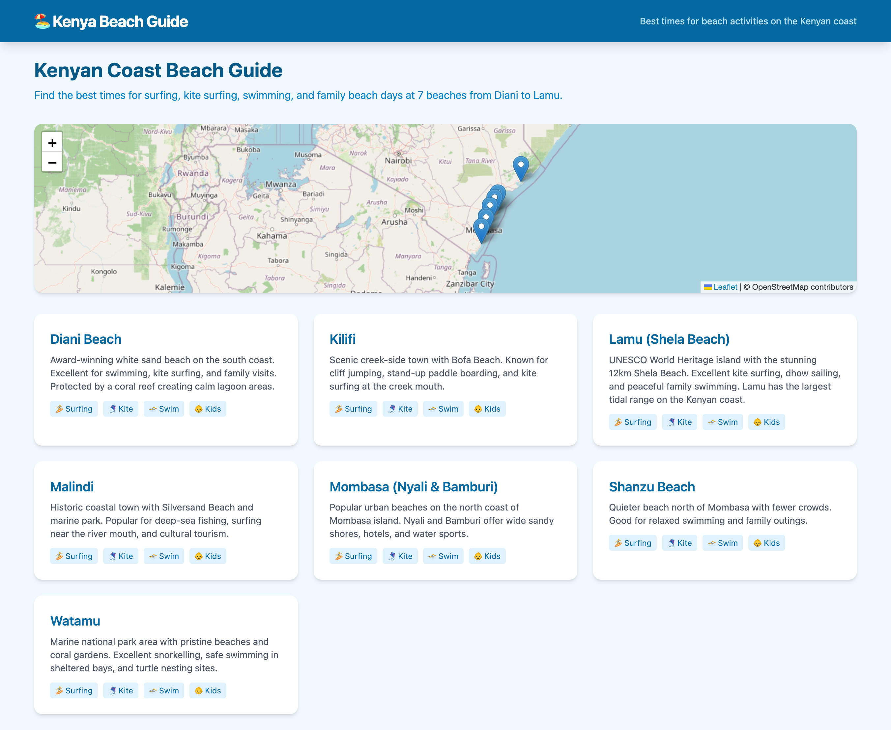
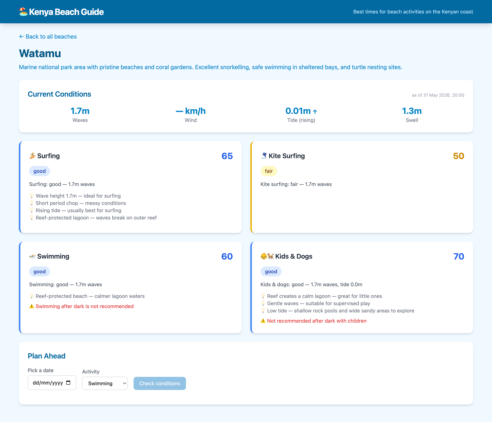

# Kenya Beach Guide

**[Live Demo](https://kenya-beach-guide.vercel.app)** • **[API Docs](https://kenya-beach-guide-api.onrender.com/docs)**

Predicts the best times for beach activities along the Kenyan coast: surfing, kite surfing, swimming, and family/kids outings, using real-time tide data from IOC sensors and marine weather forecasts.

## Features

- Real-time wave height, swell, wind, and tide data for 7 Kenyan beaches
- Activity scores (0–100) for surfing, kite surfing, swimming, and kids outings
- Safety alerts for rough seas, strong currents, and night swimming
- ML-powered tide forecasting with XGBoost + anomaly detection with Isolation Forest
- Plan Ahead tool: check conditions for any future date and activity

## Screenshots





## Beaches Covered

| Beach | Location | Best For |
|-------|----------|----------|
| Diani Beach | South Coast | Kite surfing, kids (reef-protected lagoon) |
| Mombasa (Nyali/Bamburi) | Central | Swimming, family beach days |
| Shanzu Beach | North of Mombasa | Quiet swimming, relaxation |
| Kilifi | Creek area | Kite surfing, SUP, cliff jumping |
| Watamu | Marine park | Snorkelling, swimming (reef-protected) |
| Malindi | North Coast | Surfing (river mouth break), fishing |
| Lamu (Shela) | Far North | Kite surfing, dhow sailing, family |

## Quick Start

### Option A: Docker (recommended)

```bash
docker compose up --build -d
```

- Frontend: http://localhost:3001
- API docs: http://localhost:8200/docs
- Database: `localhost:5433` (user: `beach`, password: `beach`)

### Option B: Local development

```bash
make setup           # Create venv + install deps
make dev-backend     # Start API on port 8200
make dev-frontend    # Start UI on port 5174
```

### Ingest data and train models

```bash
make ingest          # Fetch 1 year of tide data from IOC
make ingest-weather  # Fetch 3-day marine/wind forecast
make train           # Train forecast + anomaly models
```

## Architecture

```
┌─────────────┐     ┌──────────────┐     ┌───────────────┐
│   Vue 3 UI  │────▶│  FastAPI     │────▶│  TimescaleDB  │
│  (Vite)     │     │  Backend     │     │  (PostgreSQL) │
└─────────────┘     └──────┬───────┘     └───────────────┘
                           │
                    ┌──────┴───────┐
                    │  Schedulers  │
                    └──────┬───────┘
                    ┌──────┴───────┐
              ┌─────┤              ├─────┐
              ▼     ▼              ▼     ▼
         IOC API  Open-Meteo   XGBoost  Activity
         (tides)  (wind/waves) (ML)     Scorer
```

## Data Sources

| Source | Data | API Key |
|--------|------|---------|
| [IOC Sea Level Monitoring](https://ioc-sealevelmonitoring.org) | Tide gauge readings (Mombasa & Lamu) | Not required |
| [Open-Meteo Marine API](https://open-meteo.com) | Wave height, swell, wind, temperature | Not required |

## Project Structure

```
kenya-beach-guide/
├── backend/
│   ├── main.py              # FastAPI entry point
│   └── src/
│       ├── api/             # REST endpoints (beaches, activities, tides)
│       ├── data/            # IOC + Open-Meteo API clients and ingestion pipeline
│       ├── features/        # ML feature engineering
│       ├── models/          # XGBoost training, anomaly detection, inference
│       └── services/        # Recommendation engine
├── frontend/                # Vue 3 + Tailwind dashboard
├── docs/                    # Documentation and screenshots
├── models/                  # Trained ML models (.joblib)
├── docker-compose.yml
└── Makefile
```

## Documentation

- [Setup Guide](docs/setup-guide.md): Installation and configuration
- [Data Flow](docs/data-flow.md): How data moves through the system
- [ML Models](docs/ml-models.md): Model architecture and training
- [API Reference](docs/api-reference.md): REST API documentation
- [Activity Scoring](docs/activity-scoring.md): How activities are scored

## Tech Stack

**Backend:** Python 3.11, FastAPI, SQLAlchemy 2.0, XGBoost, scikit-learn, APScheduler
**Frontend:** Vue 3, Vite, Pinia, Tailwind CSS, Leaflet, ECharts
**Database:** TimescaleDB (PostgreSQL) and SQLite (dev)
**APIs:** IOC Sea Level Monitoring, Open-Meteo Marine & Forecast

## License

MIT
